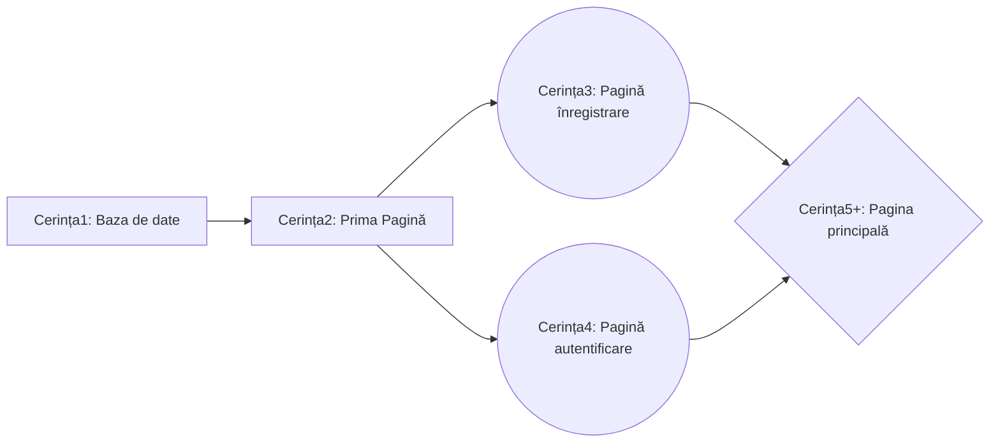

# Olimpiada C# - noțiuni de bază

## Cuprins:
- Introducere
- Baza de date
  - Funcții SQL
  - Implementare C#
    - Inserare/Stergere/Modificare/Selectare valori din baza de date
- Concepte noi C#
  - Tipuri variabile
  - Funcții de bază
- Formulare (Forms)
  - Proprietăți
  - Inserarea obiectelor din meniul Toolbox Funcții ce se execută în funcție de acțiunile utilizatorului (MouseClick, MouseHover, ValueChanged)
    - Label
    - TextBox
    - Button
    - Form 
      - Deschiderea unui nou Form
    - PictureBox
      -Desenarea pe imagini
    - ComboBox
    - DateTimePicker
    - Timer
    - TabControl
    - ProgressBar
    - DataGridView
    - Chart
      - Line Chart
      - Pie Chart
      
      
## Introducere
Olimpiada presupune construirea unei aplicații, folosind elemente caracteristice din WinForm (Visual Studio). Aceasta se va folosi de o **bază de date** și va presupune în mare parte calcul tabelar, **afișarea** unor elemente în anumite obiecte specifice din meniul ToolBox sau **verificarea** unor elemente în urma diverselor interacțiuni ale utilizatorului cu astfel de obiecte.
   
   > Unele noțiuni de C# pot fi utile în ușurarea procesului de realizare al aplicației
   
Cerințele respectă o oarecare ordine de rezolvare:

## Baza de date
### Funcții SQL
Fiecare cerință necesită utilizarea funcțiilor SQL, chiar și de un număr ridicat de ori.
#### DELETE și TRUNCATE TABLE
Șterg valorile dintr-un tabel:
```SQL
DELETE FROM nume_tabel
TRUNCATE TABLE nume_tabel
```
> Diferența dintre cele două este că DELETE șterge valori până la ultima linie **X**, iar inserarea unor noi elemente începe de la linia **X+1**. În unele cerințe se cere mereu inserarea de la linia **X=1** și astfel TRUNCATE TABLE permite acest lucru (șterge datele complet a fiecărei linii)
#### INSERT
Inserează elemente:
```SQL
INSERT INTO nume_tabel VALUES x1,x2,x3,...
INSERT INTO nume_tabel(coloanaX,coloanaY,coloanaZ...) VALUES x1,x2,x3,...
```
> Prima funcție inserează în coloane, pe rând iar a doua doar în coloanele precizate
#### SELECT
Selectează valori din tabel:
```SQL
SELECT * FROM nume_tabel
SELECT coloanaX, coloanaY FROM nume_tabel
```
##### Funcții specifice:
- COUNT(coloanaX): returnează numărul de coloane
- DISTINCT(coloanaX): returnează coloanele luate o singură dată
- YEAR(coloanaX)/MONTH(coloanaX)/...: (în cazul în care tipul de data e datetime) returneaza anul/ziua/... variabilei
#### WHERE
Pune o condiție.
Se poate folosi cu operatorii **AND** sau **OR**:
```SQL
... WHERE conditie1 AND conditie2
```
#### UNION
Formează o tabelă cu valori selectate din mai multe tabele:
```SQL
SELECT coloanaX FROM tabel1 WHERE condtie1
UNION
SELECT coloanaA, coloanaB FROM tabel2 WHERE condtie2
```
#### INNER JOIN
Permite accesarea valorilor din 2 sau mai multe tabele în funcție de o cheie comună (ex. **id_elev** pentru tabelele **elevi** și **note**):
```SQL
SELECT nume, prenume, medie FROM elevi INNER JOIN note ON elevi.id_elev=note.id_elev;
```
Sau în caz general, unde a_x și b_x coincid:
```SQL
SELECT a_1,a_2,...,b_1,b_2,... FROM a INNER JOIN b ON a.a_x=b.b_x;
```

### Implementare C#
- 1 Crearea bazei de date

După crearea proiectului, în meniul **Server Explorer** se va apăsa **Connect to Database**
În noua fereastră se va selecta pentru **Data source**: **Microsoft SQL Server Database File (SqlClient)**, iar la nume întreaga adresă pâna la folderul **\bin\Debug\** al proiectului, urmat de numele bazei de date (cu extensia .mdf)
- 2 Crearea tabelelor

Server Explorer -> Nume baza de date -> Tables -> Add new table

- 3 Realizarea conexiunii

Din proprietățile bazei de date se copiază **ConnectionString** și se inserează între ""
```cs
SqlConnection con = new SqlConnection(@"");
```
Operații cu conexiunea:
```cs
con.Open();
con.Close();
```
> Pentru realizarea portabilității, în urma primei rulări ale proiectului (după crearea obiectului con și rularea funcției con.Open()), se va modifica adresa din ConnectionString în |DataDirectory|\nume_bazadate.mdf . 

> De exemplu, ConnectionString este **"Data Source=(LocalDB)\MSSQLLocalDB;AttachDbFilename=C:\Users\Mirel\Desktop\Proiect\bin\Debug\bazadate.mdf;Integrated Security=True;Connect Timeout=30"** și adresa din ConnectionString e **"C:\Users\Mirel\Desktop\Proiect\bin\Debug\bazadate.mdf"**, atunci în urma rulării se va schimba în **"|DataDirectory|\bazadate.mdf"**. 
-  4 Rulare funcții
Sunt 3 tipuri de funcții ce pot fi executate
  - ExecteNonQuery() pentru funcții SQL care nu returnează valori
  - ExecuteScalar() pentru funcții SQL care returnează o singură valoare
  - ExecuteReader() pentru funcții SQL care returnează ma multe valoari
Implementare:
```cs
SqlCommand inserare= new SqlCommand("",con); 
//intre "" se trece functia corespunzatoare din SQL pentru inserare
inserare.ExecuteNonQuery();
 
SqlCommand stergere = new SqlCommand("",con); 
//intre "" se trece functia corespunzatoare din SQL pentru stergere
stergere.ExecuteNonQuery();
  
SqlCommand modificare = new SqlCommand("",con); 
//intre "" se trece functia corespunzatoare din SQL pentru modificare (updatare)
modificare.ExecuteNonQuery();
```
```cs
SqlCommand selectare = new SqlCommand("",con); 
//intre "" se trece functia corespunzatoare din SQL pentru selectarea unei valori
tip_variabila x= (tip_variabila)selectare.ExecuteScalar() ; 
// în funcție de ce valori se returnează (vezi Concepte noi C#, Tipuri variabile si Functii de baza)
tip_variabila x= Convert.ToTipVariabila(selectare.ExecuteScalar()) ;
  
  
//exemple
int x=(int)selectare.ExecuteScalar(); 
string y=Convert.ToString(selectare.ExecuteScalar());
```
```cs
SqlCommand selectare = new SqlCommand("",con); 
//intre "" se trece functia corespunzatoare din SQL pentru selectarea a mai multor valori
SqlDataReader read = selectare.ExecuteReader();
while(read.Read())
{
tip_variabila1=read.GetTipVariabila1(0); //ia variabila de pe pozita 0, de tipul TipVariabila
  tip_variabila2=read.GetTipVariabila2(0);
    
  //exemple
  int x=read.GetInt32(0);
  string y=read.GetString(1);
  Datetime zi=read.GetDateTime(2);
}
```
> Se recomandă folosirea structurii: sqlcommand.Parameters.AddWithValue("nume",valoare1) pentru prima valoare a adresei "nume", iar pentru modificarea ei, sqlcommand.Parameters["nume"]=valoare2;


## Concepte noi C#
### Tipuri variabile
```cs
private a   //privat, accesat doar din aceeasi clasa
public a    //public, accesibil din alte clase
protected a //protejat, accesibil din alte clase, dar nu si editabil
// unde a este variabila, functie (private void a(int n)) etc.

int a=1 //integer
double b=2.43 //double
string c="aaaa" //string

int[] d; //vector
int[] d=new int[10] // vector cu 10 elemente
d[0] //primul element

int[,] e; //matrice
int[,] e=new int[100,100] //matrice de 100 pe 100
e[12,12] //elementul de pe linia 12, coloana 12

(int,int,int,...) f; //colectie de valori pentru f
f.Item1  //primul element

List<(int,double,string,...)> g= new List<(int,double,string,...)>(); //vector(Lista) care stocheaza mai multe valori
g[0].Item1 //primul termen al primului element din lista
g[5].Item4 //al patrulea termen al celui de-al saselea element din lista
g.Add(var1, var2, var3,...) //adaugare elemente in lista
```
### Funcții de bază
```cs
//CONVERSII
double a=2.3;
int b=(int)a;   //Conversie directa
int b=Convert.ToInt32(a); //Conversie propriu-zisa

string a="23";
int b=(int)a; //Conversie directa -NU MERGE!!!
int b=Convert.ToInt32(a) //Conversie propriu-zisa -MERGE

//FUNCTII string
string a="HAh!aHA";
int b=a.Lenght;
string[] c=a.Split('!'); //creeaza vectorul c cu "bucatile" separate din a
string d=a.Split('!')[0] //d ia valoarea primului string din a, delimitat de caracterul '!'

//CITIRE
string x=Console.ReadLine(); //citire din consola
string x=citire.ReadLine(); //citire din fisier text, unde citire este de tip StreamReader

//CITIRE DIN FISIER
StreamReader citire= new StreamReader("") // intre "" este adresa fisierului
string line;
while((line=citire.ReadLine())!=null){}

//AFISARE
string a="Hello World";
Console.WriteLine(a); //Hello World

MessageBox.Show("Eroare","Titlu"); // afiseaza un mesaj, cu textul "Eroare" si titlul (optional) "Titlu"
MessageBox.Show("Text","Titlu", MessageBoxButtons.YesNo)//panou cu mesajul "Text",titlul "Titlu" si 2 butoane(Da si Nu)

DialogResult a=MessageBox.Show("Text","Titlu", MessageBoxButtons.YesNo);
if(a==DialogResult.Yes) ... //Se executa lucruri daca se apasa Da
if(a==DialogResult.No)  ... //Se executa lucruri daca se apasa Nu

FUNCTII DateTime
DateTime data=DateTime.Now //data curenta
DateTime data_normala=DateTime.ParseExact(data_ca_la_americani,"M/d/yyyy",CultureInfo.InvariantCulture);

DateTime inceput=...; //o data oarecare
DateTime final=inceput+TimeSpan.FromDays(30); //returneaza data inceput dupa 30 de zile
DateTime final2=inceput+TimeSpan.FromHours(1000); //returneaza data inceput dupa 1000 de ore
```
