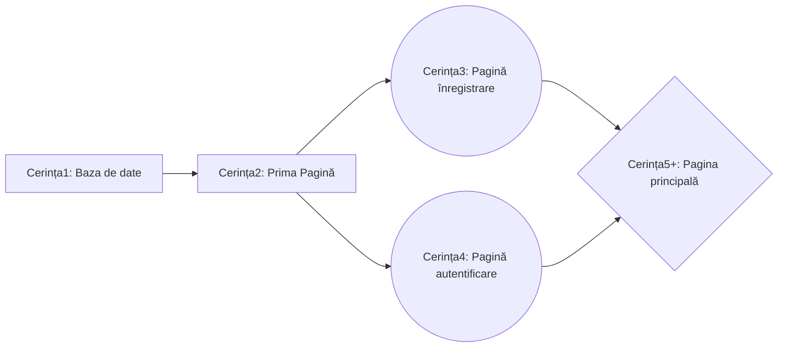

# Olimpiada C# - noțiuni de bază

## Cuprins:
- Introducere
- Baza de date
  - Funcții SQL
  - Implementare C#
  - Inserare/Stergere/Modificare/Selectare valori din baza de date
- Concepte noi C#
  - Tipuri variabile
  - Funcții de bază
- Formulare (Forms)
  - Proprietăți
  - Inserarea obiectelor din meniul Toolbox Funcții ce se execută în funcție de acțiunile utilizatorului (MouseClick, MouseHover, ValueChanged)
    - Label
    - TextBox
    - Button
    - Form 
      - Deschiderea unui nou Form
    - PictureBox
      -Desenarea pe imagini
    - ComboBox
    - DateTimePicker
    - TabControl
    - ProgressBar
    - DataGridView
    - Chart
      - Line Chart
      - Pie Chart
      
      
## Introducere
Olimpiada presupune construirea unei aplicații, folosind elemente caracteristice din WinForm (Visual Studio). Aceasta se va folosi de o **bază de date** și va presupune în mare parte calcul tabelar, **afișarea** unor elemente în anumite obiecte specifice din meniul ToolBox sau **verificarea** unor elemente în urma diverselor interacțiuni ale utilizatorului cu astfel de obiecte.
   
   > Unele noțiuni de C# pot fi utile în ușurarea procesului de realizare al aplicației
   
Cerințele respectă o oarecare ordine de rezolvare:

## Baza de date
### Funcții SQL
Fiecare cerință necesită utilizarea funcțiilor SQL, chiar și de un număr ridicat de ori.
#### DELETE și TRUNCATE TABLE
Șterg valorile dintr-un tabel:
```SQL
DELETE FROM nume_tabel
TRUNCATE TABLE nume_tabel
```
> Diferența dintre cele două este că DELETE șterge valori până la ultima linie **X**, iar inserarea unor noi elemente începe de la linia **X+1**. În unele cerințe se cere mereu inserarea de la linia **X=1** și astfel TRUNCATE TABLE permite acest lucru (șterge datele complet a fiecărei linii)
#### INSERT
Inserează elemente:
```SQL
INSERT INTO nume_tabel VALUES x1,x2,x3,...
INSERT INTO nume_tabel(coloanaX,coloanaY,coloanaZ...) VALUES x1,x2,x3,...
```
> Prima funcție inserează în coloane, pe rând iar a doua doar în coloanele precizate
#### SELECT
Selectează valori din tabel
```SQL
SELECT * FROM nume_tabel
SELECT coloanaX, coloanaY FROM nume_tabel
```
##### Funcții specifice:
- COUNT(coloanaX): returnează numărul de coloane
- DISTINCT(coloanaX): returnează coloanele luate o singură dată
- YEAR(coloanaX)/MONTH(coloanaX)/...: (în cazul în care tipul de data e datetime) returneaza anul/ziua/... variabilei

