# Olimpiada C# - noțiuni de bază

## Cuprins:
- Introducere
- Baza de date
  - Funcții SQL
  - Implementare C#
    - Inserare/Stergere/Modificare/Selectare valori din baza de date
- Concepte noi C#
  - Tipuri variabile
  - Funcții de bază ..........................****UPDATE-11.04.2023****
    - Try-Catch ............................****UPDATE-11.04.2023****
- Formulare (Forms)
  - Proprietăți
  - Inserarea obiectelor din meniul Toolbox. Funcții ce se execută în funcție de acțiunile utilizatorului (MouseClick, MouseHover, ValueChanged)
    - Label
    - TextBox
    - Button
    - Form 
      - Deschiderea unui nou Form
    - PictureBox
      - Desenarea pe imagini
        - Eventul Paint ...****UPDATE-19.04.2023****
    - ComboBox
    - DateTimePicker
    - Timer
    - TabControl
    - ProgressBar
    - DataGridView
    - Chart
      - Line Chart
      - Pie Chart
    - RadioButton ......................****UPDATE-10.04.2023****
    - CheckBox ...........................****UPDATE-10.04.2023****
    - FolderBrowserDialog .....****UPDATE-11.04.2023****
    - ListBox .................................****UPDATE-11.04.2023****
    - SaveFileDownload ..........****UPDATE-11.04.2023****
    - Mdi Container ..................****UPDATE-19.04.2023****
    - MenuStrip ..........................****UPDATE-19.04.2023****
    - OpenFileDialog ................****UPDATE-21.04.2023****
- Ultimele detalii ...................................****UPDATE-21.04.2023****
- Materie Nationala
      
      
## Introducere
Olimpiada presupune construirea unei aplicații, folosind elemente caracteristice din WinForm (Visual Studio). Aceasta se va folosi de o **bază de date** și va presupune în mare parte calcul tabelar, **afișarea** unor elemente în anumite obiecte specifice din meniul ToolBox sau **verificarea** unor elemente în urma diverselor interacțiuni ale utilizatorului cu astfel de obiecte.
   
   > Unele noțiuni de C# pot fi utile în ușurarea procesului de realizare al aplicației
   
Cerințele respectă o oarecare ordine de rezolvare:

```mermaid
  graph LR
  A[Cerința1: Baza de date] --> B[Cerința2: Prima Pagină]
  B-->C((Cerința3: Pagină înregistrare))
  B-->D((Cerința4: Pagină autentificare))
  C-->E{Cerința5+: Pagina principală}
  D-->E
```


## Baza de date
### Funcții SQL

Fiecare cerință necesită utilizarea funcțiilor SQL, chiar și de un număr ridicat de ori.

#### DELETE și TRUNCATE TABLE

Șterg valorile dintr-un tabel:

```SQL
DELETE FROM nume_tabel
TRUNCATE TABLE nume_tabel
```
> Diferența dintre cele două este că DELETE șterge valori până la ultima linie **X**, iar inserarea unor noi elemente începe de la linia **X+1**. În unele cerințe se cere mereu inserarea de la linia **X=1** și astfel TRUNCATE TABLE permite acest lucru (șterge datele complet a fiecărei linii)
#### INSERT
Inserează elemente:
```SQL
INSERT INTO nume_tabel VALUES x1,x2,x3,...
INSERT INTO nume_tabel(coloanaX,coloanaY,coloanaZ...) VALUES x1,x2,x3,...
```
> Prima funcție inserează în coloane, pe rând iar a doua doar în coloanele precizate
#### SELECT
Selectează valori din tabel:
```SQL
SELECT * FROM nume_tabel
SELECT coloanaX, coloanaY FROM nume_tabel
```
##### Funcții specifice:
- COUNT(coloanaX): returnează numărul de coloane
- DISTINCT(coloanaX): returnează coloanele luate o singură dată
- YEAR(coloanaX)/MONTH(coloanaX)/...: (în cazul în care tipul de data e datetime) returneaza anul/ziua/... variabilei
#### WHERE
Pune o condiție.
Se poate folosi cu operatorii **AND** sau **OR**:
```SQL
... WHERE conditie1 AND conditie2
```
#### UNION
Formează o tabelă cu valori selectate din mai multe tabele:
```SQL
SELECT coloanaX FROM tabel1 WHERE condtie1
UNION
SELECT coloanaA, coloanaB FROM tabel2 WHERE condtie2
```
#### INNER JOIN
Permite accesarea valorilor din 2 sau mai multe tabele în funcție de o cheie comună (ex. **id_elev** pentru tabelele **elevi** și **note**):
```SQL
SELECT nume, prenume, medie FROM elevi INNER JOIN note ON elevi.id_elev=note.id_elev;
```
Sau în caz general, unde a_x și b_x coincid:
```SQL
SELECT a_1,a_2,...,b_1,b_2,... FROM a INNER JOIN b ON a.a_x=b.b_x;
```

### Implementare C#
- 1 Crearea bazei de date

După crearea proiectului, în meniul **Server Explorer** se va apăsa **Connect to Database**
În noua fereastră se va selecta pentru **Data source**: **Microsoft SQL Server Database File (SqlClient)**, iar la nume întreaga adresă pâna la folderul **\bin\Debug\** al proiectului, urmat de numele bazei de date (cu extensia .mdf)
- 2 Crearea tabelelor

Server Explorer -> Nume baza de date -> Tables -> Add new table

- 3 Realizarea conexiunii

Din proprietățile bazei de date se copiază **ConnectionString** și se inserează între ""
```cs
SqlConnection con = new SqlConnection(@"");
```
Operații cu conexiunea:
```cs
con.Open();
con.Close();
```
> Pentru realizarea portabilității, în urma primei rulări ale proiectului (după crearea obiectului con și rularea funcției con.Open()), se va modifica adresa din ConnectionString în |DataDirectory|\nume_bazadate.mdf . 

> De exemplu, ConnectionString este **"Data Source=(LocalDB)\MSSQLLocalDB;AttachDbFilename=C:\Users\Mirel\Desktop\Proiect\bin\Debug\bazadate.mdf;Integrated Security=True;Connect Timeout=30"** și adresa din ConnectionString e **"C:\Users\Mirel\Desktop\Proiect\bin\Debug\bazadate.mdf"**, atunci în urma rulării se va schimba în **"|DataDirectory|\bazadate.mdf"**. 

-  4 Rulare funcții

Sunt 3 tipuri de funcții ce pot fi executate
    - ExecteNonQuery() pentru funcții SQL care nu returnează valori
    - ExecuteScalar() pentru funcții SQL care returnează o singură valoare
    - ExecuteReader() pentru funcții SQL care returnează ma multe valoari
Implementare:
```cs
SqlCommand inserare= new SqlCommand("",con); 
//intre "" se trece functia corespunzatoare din SQL pentru inserare
inserare.ExecuteNonQuery();
 
SqlCommand stergere = new SqlCommand("",con); 
//intre "" se trece functia corespunzatoare din SQL pentru stergere
stergere.ExecuteNonQuery();
  
SqlCommand modificare = new SqlCommand("",con); 
//intre "" se trece functia corespunzatoare din SQL pentru modificare (updatare)
modificare.ExecuteNonQuery();
```
```cs
SqlCommand selectare = new SqlCommand("",con); 
//intre "" se trece functia corespunzatoare din SQL pentru selectarea unei valori
tip_variabila x= (tip_variabila)selectare.ExecuteScalar() ; 
// în funcție de ce valori se returnează (vezi Concepte noi C#, Tipuri variabile si Functii de baza)
tip_variabila x= Convert.ToTipVariabila(selectare.ExecuteScalar()) ;
  
  
//exemple
int x=(int)selectare.ExecuteScalar(); 
string y=Convert.ToString(selectare.ExecuteScalar());
```
```cs
SqlCommand selectare = new SqlCommand("",con); 
//intre "" se trece functia corespunzatoare din SQL pentru selectarea a mai multor valori
SqlDataReader read = selectare.ExecuteReader();
while(read.Read())
{
tip_variabila1=read.GetTipVariabila1(0); //ia variabila de pe pozita 0, de tipul TipVariabila
  tip_variabila2=read.GetTipVariabila2(0);
    
  //exemple
  int x=read.GetInt32(0);
  string y=read.GetString(1);
  Datetime zi=read.GetDateTime(2);
}
```
> Se recomandă folosirea structurii: sqlcommand.Parameters.AddWithValue("nume",valoare1) pentru prima valoare a adresei "nume", iar pentru modificarea ei, sqlcommand.Parameters["nume"]=valoare2;


## Concepte noi C#
### Tipuri variabile
```cs
private a   //privat, accesat doar din aceeasi clasa
public a    //public, accesibil din alte clase
protected a //protejat, accesibil din alte clase, dar nu si editabil
// unde a este variabila, functie (private void a(int n)) etc.

int a=1 //integer
double b=2.43 //double
string c="aaaa" //string

int[] d; //vector
int[] d=new int[10] // vector cu 10 elemente
d[0] //primul element

int[,] e; //matrice
int[,] e=new int[100,100] //matrice de 100 pe 100
e[12,12] //elementul de pe linia 12, coloana 12

(int,int,int,...) f; //colectie de valori pentru f
f.Item1  //primul element

List<(int,double,string,...)> g= new List<(int,double,string,...)>();//Lista care stocheaza mai multe valori
g[0].Item1 //primul termen al primului element din lista
g[5].Item4 //al patrulea termen al celui de-al saselea element din lista
g.Add(var1, var2, var3,...) //adaugare elemente in lista
```
### Funcții de bază
```cs
//CONVERSII
double a=2.3;
int b=(int)a;   //Conversie directa
int b=Convert.ToInt32(a); //Conversie propriu-zisa

string a="23";
int b=(int)a; //Conversie directa -NU MERGE!!!
int b=Convert.ToInt32(a) //Conversie propriu-zisa -MERGE

//FUNCTII string
string a="HAh!aHA";
int b=a.Lenght;
string[] c=a.Split('!'); //creeaza vectorul c cu "bucatile" separate din a
string d=a.Split('!')[0] //d ia valoarea primului string din a, delimitat de caracterul '!'

//CITIRE
string x=Console.ReadLine(); //citire din consola
string x=citire.ReadLine(); //citire din fisier text, unde citire este de tip StreamReader

//CITIRE DIN FISIER
StreamReader citire= new StreamReader("") // intre "" este adresa fisierului
string line;
while((line=citire.ReadLine())!=null){}

//AFISARE
string a="Hello World";
Console.WriteLine(a); //Hello World

MessageBox.Show("Eroare","Titlu"); // afiseaza un mesaj, cu textul "Eroare" si titlul (optional) "Titlu"
MessageBox.Show("Text","Titlu", MessageBoxButtons.YesNo)//panou cu mesajul "Text",titlul "Titlu" si 2 butoane(Da/Nu)

DialogResult a=MessageBox.Show("Text","Titlu", MessageBoxButtons.YesNo);
if(a==DialogResult.Yes) ... //Se executa lucruri daca se apasa Da
if(a==DialogResult.No)  ... //Se executa lucruri daca se apasa Nu

FUNCTII DateTime
DateTime data=DateTime.Now //data curenta
DateTime data_normala=DateTime.ParseExact(data_ca_la_americani,"M/d/yyyy",CultureInfo.InvariantCulture);
// merge dupa includerea: using System.Globalisation;

DateTime inceput=...; //o data oarecare
DateTime final=inceput+TimeSpan.FromDays(30); //returneaza data inceput dupa 30 de zile
DateTime final2=inceput+TimeSpan.FromHours(1000); //returneaza data inceput dupa 1000 de ore

//functii lambda
public int suma(int n) //functia normala
{
  int s=0;
  while(n!=0)
  {
    s+=n%10;
    n/=10;
  }
  return s;
}

int v=suma(12332); //apel

int v= (int n) =>  //declarare+apel 
{
  int s=0;
  while(n!=0)
  {
    s+=n%10;
    n/=10;
  }
  return s;
}
//tipul returnat e dedus automat

//caz general
var x= (int parametru1, parametru2, ...) => {/*cod*/}
```
****UPDATE-11.04.2023****
```cs
DateTime data=new Convert.ToDateTime("12.12.1994"); //converteste din string in datetime

data=data.AddDays(int i) //modifica data cu cea de peste i zile
data=data.Add____(double i) //poate fi Years,Months,Days,Hours,Minutes,Seconds...

data.ToString("dd/MM/yyyy") //converteste data in string folosind formatul special

b = read.IsDBNull(1) ? null : read.GetDateTime(1).ToString("dd/MM/yyyy"); 
//verifica daca o coloana din tabel contine null
```
#### Try-Catch****UPDATE-11.04.2023****

Expresia try-catch

Se foloseste atunci când o porțiune de cod va da eroare însă se vrea continuarea acestuia, folosind alte funcții. Un exemplu ar fi afișarea/inserarea elementelor dintr-o tabelă care are coloane ce conțin valoarea **null**, într-un obiect. Deși va da eroare când se vor face verificări/operații cu null, ramura catch permite execuția a altor funcții, pentru ca în final să nu apară nicio eroare ce ar opri programul. Astfel, dacă dorim să afișăm valorile într-un DataGridView și dăm de o coloană ce conține null, catch va schimba valoarea inserată în altceva (ex. " ").

Pentru exemplul dat, este o alternativă mai accesibilă pentru funcția .IsDBNull(), însă merge și pe alte cazuri generale.
```cs

//caz general
try
{
  ....// chestie ce ar putea da eroare
}
catch
{
  ....// executa .... daca da eroare
}

// exemplu
try
{
  int id=read.GetInt32(0); //"incearca" operatia de atribuire
  dataGridView.Add(id,1);
}
catch
{ 
  int id=0;   //cazul in care read.GetInt32(0) returneaza null
  dataGridView.Add(id,1);
}
```


## Formulare (Forms)
Un form poate fi numit o fereastră în care se introduc o serie de obiecte prin care se obțin, se prelucrează și se afișează informații de la/pentru utilizator. Aceste obiecte pot fi căsuțe text, imagini, butoane, diagrame, selectoare valori sau data etc..
### Proprietăți
Fiecare obiect (inclusiv formular) are o serie de proprietăți sau acțiuni ce le poate îndeplini
- Proprietăți generale:
  - BackgroundImage
  - BackgroundImageLayout (modul în care se pozitionează imaginea (tile/stretch/center etc.))
  - Font
  - ForeColor (culoare text)
  - Text (valoarea inițială afișată de obiect - ex. Form-> Titlul Formului/ Label -> ce este scris in label)
  - TextAlign
  - Enabled (permite accesarea obiectului)(enabled/disabled)
  - Visible (permite vizualizarea obiectului)(enabled/disabled)
  - Multiline 
  - PasswordChar (se pune caracterul selectat în loc de litere - pentru câmpuri pentru parolă)
  - (Name) (numele obiectului)
  > Numele obiectului poate fi schimbat doar dacă nu există nicio funcție asociată obiectului
  - Locked (nu permite dimensionarea)
  - Size (width; height)
  - StartPosition (unde se deschide Formul (centru, unde e mouse-ul, etc.)
  - Icon (imagine)
  - Dock (ex. imagine- de care parte a Formului se "prinde" imaginea (Fill-ocupă tot Formul, Left-ocupă partea stângă, dar lasă loc de modificare lungime la dreapta))

În cazul în care se dorește "înregistrarea" unei acțiuni a unui obiect, se deschide fila Events din partea de sus, de lângă fila deja selectată de proprietăți. Apoi se dă dublu click pe acțiunea dorită și se pune codul dorit în funcția creată automat.

- Acțiuni frecvente (Events)
  - MouseClick 
  - MouseHover (daca cursorul este peste obiect)
  - MouseLeave (opusul MouseHover - daca cursorul pleacă de pe obiect)
 
### Obiecte Toolbox
#### Label
Zonă unde se introduce text indirect (prin funcții și nu de la tastatura utilizatorului).


Funcții:
```cs
string a=label1.Text; //valoarea din label
label1.Text="Ceva"; //schimbare valoare label
```

#### TextBox
Zonă unde se poate introduce text direct (prin funcții și de la tastatura utilizatorului).


Funcții:
```cs
string a=textBox1.Text; //valoarea din label
textBox1.Text="Ceva"; //schimbare valoare label
```
Event:
- TextChanged: se creează funcția:
```cs 
private void textBox1_TextChanged(object sender, EventArgs e)
{
  //cod
}
```

#### Button
Buton ce poate fi apăsat.


Event:
- MouseClick: se creează funcția:
```cs 
private void button1_MouseClick(object sender, EventArgs e)
{
  //cod
}
```

#### Form
Se poate creea un nou Form din Solution Explorer-> click dreapta pe numele proiectului-> Add-> Form (Windows Forms)


Funcții:
- Deschiderea unui Form creat (de ex. cu numele standard Form2/Form3/...)
```cs
Form2 nume=new Form2();
nume.ShowDialog();
```
> Se utilizează numele frm2/frm3/... pentru a ușuara procesul

> În cazul în care se creează o variabilă **publică** în interiorul clasei Form2/Form3/... și se creează astfel un obiect frm2/frm3/..., variabila poate fi accesată din alt Form folosind: var x=frm2.nume_variabila/frm3.nume_variabila/...;

- Deschiderea unui Form creat și închiderea celui precedent
```cs
Form2 nume=new Form2();
this.Hide();
nume.ShowDialog();
this.Close();
//In aceasta ordine
```

#### PictureBox
Chenar unde se inserează o imagine.


Funcții:
```cs
pictureBox1.BackgroundImage= Image.FromFile(@""); //intre "" se pune adresa imaginii de fundal
pictureBox1.Image= Image.FromFile(@""); //intre "" se pune adresa imaginii

pictureBox1.Refresh();

float x=pictureBox1.Width; //lungimea imaginii
float y=pictureBox1.Heigth; //latimea(inaltimea) imaginii
float x=pictureBox1.BackgroundImage.Width; //lungimea imaginii de fundal
float y=pictureBox1.BackgroundImage.Heigth; //latimea(inaltimea) imaginii de fundal
```
Event:

- MouseClick
```cs
private void pictureBox1_MouseClick(object sender, MouseEventArgs e)
{
  float X= e.X; //coordonata x a locului unde s-a apasat click
  float Y= e.Y; //coordonata y a locului unde s-a apasat click
}
```
> e devine MouseEventArgs și permite memorarea a mai multor informații despre mouse (ex. poziție)

##### Desenarea unor obiecte peste obiecte
De cele mai multe ori se va desena peste imagini (pictureBox) dar se poate desena și pe alte obiecte.

Pentru pictureBox:
```cs
Graphics desen = pictureBox1.CreateGraphics(); //declararea zonei unde se va face desenul

//Reinitializare zona (in functie de cerinta)
desen.Clear(Color.White);
pictureBox1.Refresh();
//

Pen pen= new Pen(Color.Black,2) // poate fi si Color.White/Yellow/Red/... , 2 reprezinta grosimea

//desenare elipsa
desen.DrawEllipse(pen, x, y, a, b); 
//deseneaza o elipsa cu dimensiunea a, b (valori modificabile) (a==b -> cerc)
//in punctul de coordonate x si y al zonei de desen

//desenare string
desen.DrawString (valoare, new Font("Arial",12), new SolidBrush(Color.Red), x, y);
// valoare= stringul cu valoarea dorita
// Font(string a,int b): a si b sunt modificabile, in functie de font
// SolidBrush(Color.c) c poate fi orice culoare standard

//desenare linie
desen.DrawLine(pen,x1,y1,x2,y2);
//deseneaza o linie de la punctul A(x1,y1) la B(x2,y2)

//deseneaza patrat
desen.DrawRectangle(pen, x, y, L, l);
// x, y coordonate in zona de desenat
// L, l lungime si latime
```
Rezumat pași:

```mermaid
  flowchart LR
  A[Obiect pe care desenezi] --> B[Declarare zonă]
  B--> C[Construire Pen]
  C--> D[Construire funcție]
  D--x|Executare funcție| A
```


##### Eventul Paint ****UPDATE-19.04.2023****
Desenează pe un obiect, fără declarare de zona.

Funcționeză când .CreateGraphics nu funcionează.

```cs
//exemplu pentru pictureBox

private void pictureBox1_Paint(object sender, PaintEventArgs e)
{
  Pen pen = new Pen(Color.Red, 2); //standard
  
  e.Graphics. DrawLine(Pen, x1,y1,x2,y2);
            . DrawRectangle(....)
            . DrawString(....)
 // e este parametrul care apare la apelarea functiei (...,PaintEventArgs e)
}
```

#### ComboBox

Selector al unui element dintr-o listă dată. (Ex. vrei să alegi țara și ți se deschide o listă)


Funcții
```cs
int a=comboBox1.SelectedIndex; //memoreaza in a indicele 
comboBox1.SelectedIndex=(int)b;  //schimba optiunea aleasa cu cea cu indicele b

// exemplu
if((int)comboBox1.SelectedIndex==0){} 


comboBox1.DropDownStyle = ComboBoxStyle.DropDownList; // comboBox needitabil la tastatura


comboBox1.Items.Add("");// adaugare optiune (numele intre "")


string optiune=comboBox1.SelectedItem; //memoreaza in optiune valoarea aleasa de tip string

// exemplu
if((string)comboBox1.SelectedItem=="Optiune1"){} 

```

Events

```cs
private void comboBox1_SelectedValueChanged(object sender, EventArgs e) //se schimba valoarea
{
...
}
private void comboBox1_SelectedIndexChanged(object sender, EventArgs e) //se schimba valoarea
{
...
}
```
#### DateTimePicker

Asemănător comboBox-ului. Deschide un mini calendar care permite accesarea unei date.


Funcții
```cs
DateTime data = dateTimePicker1.Value; // memoreaza data aleasa (zi/luna/an + ora/minut/secunda)
DateTime data = dateTimePicker1.Value.Date; //memoreaza data aleasa (zi/luna/an)

TimeSpan x=DateTime.Now.TimeOfDay // interval de timp de la 00:00 pana acum
```
**În unele cazuri va fi nevoie să moidifcăm formatul în care se stochează valori.
Acest lucru se poate întâmpla și la inserarea de valori într-o tabelă.**
```cs
dateTimePicker1.Format=dateTimePicker.Format.Custom; // modificare format dateTimePicker
dateTimePicker.CustomFormat ="";

DateTime format_dorit=DateTime.ParseExact(format_dat, "", CultureInfo.InvariantCulture)
```
**Între "" se va trece formatul dorit, folosind notațiile:**
- d - Day of the month.
- ddd - Short name of day of the week.
- dddd - Full name of day of the week.
- M – The month, from 1 through 12.
- MMM- Short name of Month.
- MMMM- Long name of the Month.
- yy - Last two digit if year.
- yyyy - Full Year.
- hh – Hour.
- mm – Minutes.
- ss – Seconds.
- tt - The AM/PM designator.

**EXEMPLU : "MMMM, d, yyyy" (ex. Aprilie, 1, 2023)**

Events

```cs
private void dateTimePicker1_ValueChanged(object sender, EventArgs e) //se schimba valoarea
{
  ...
}
```

#### Timer

Timer este un temporizator; execută o acțiune la un interval de timp (tick).

Este atât un obiect din Toolbox, cât și unul declarabil în cod.

Funcții:
```cs
Timer timer=new Timer();
timer.Interval= 1000; // intervalul de timp, in milisecunde (1000 ms= 1 s)
bool oprit=false;
timer.Tick += (a,b) => {oprit=true; timer.Stop();}; //functie lambda
timer.Start();
while(!oprit)
{ 
  Application.DoEvents();
}
timer.Stop();
```
#### TabControl

Obiect care permite vederea a mai multe pagini, în același Form.

Astfel, tabControl va avea proprietățile sale, iar fiecare pagină, separat pe ale ei.

O pagină poate fi adăugată/modificată/ștearsă din: Proprietăți tabControl -> TabPages -> click pe ... (Collection)

Pentru inserare obiecte pe o pagină anume, se va selecta propriu-zis eticheta cu pagina respectivă și se va proceda ca înainte.


Events:
```cs
private void tabControl1_SelectedIndexChanged(object sender, EventArgs e) //se schimba de pe o pagina pe alta
{
  ...
}
```

#### ProgressBar

Bară de progres; afișează a x-a parte dintr-un număr y, reprezentând un total (maxim).


Funcții:
```cs
progressBar1.Maximum=y; //valoarea maxima
progressBar1.Value=x;   //valoarea curenta (<= maxim)
```

#### DataGridView

Obiect care permite observarea unor elemente, sub forma unui tabel.

La început se pot inițializa coloanele cu nume, tip celule(text, button, checkbox, combobox, image, link), din Proprietăți dataGridView -> Columns -> click pe ... (Collection)


Funcții:
```cs
dataGridView1.Rows.Clear(); //sterge toate liniile
dataGridView1.Rows.Add(valoare1, valoare2, ...); // adauga valori in functie de cate coloane sunt

dataGridView1.Rows[x].DefaultCellStyle.BackColor =Color.Red;// schimba culoarea liniei cu indicele x

var x=dataGridView1[i,j].Value; // se ia valoarea de pe coloana i-1, linia j-1 (indexare de la 0)
var y=dataGridView1["Nume",4].Value // se ia valoarea de pa coloana "Nume", linia 3
```

Events:
```cs
 private void dataGridView1_CellClick(object sender, DataGridViewCellEventArgs e) //se apasa o celula
{
  if(e.RonIndex==2){} //verifica daca s-a apasat o celula de pe linia 3
  if(e.ColumnIndex==3){} //verifica daca s-a apasat o celula de pe coloana 4
}
```

#### Chart

Grafic care reprezintă vizual anumite seturi de valori.

Fiecare chart e compus dintr-o serie de colecții de valori:

```mermaid
mindmap
  root((Chart))
    Annotations
      ...
    ChartAreas
      Porțiune1 grafic1
      Porțiune2 grafic2
      ...
    Legends
      Legenda1
      Legenda2
      ...
    Series
      Seria1 cu anumite puncte care compun graficul
      Seria2 cu anumite puncte care compun graficul
      ...
    Titles
      Titlu1
      Titlu2
      ...
```


#### Line Chart


Se va creea inițial seria de puncte (ex. "valori").

Seria se poate accesa ori prin nume, ori prin indice (Series["valori"]=Series[0]).

Funcții:
```cs
chart1.Series["valori"].Points.Clear();
chart1.Series["valori"].Points.AddXY(valoare1, valoare2);//valoarea 1 va aparea pe axa OX, iar a doua pe OY

//exemplu
chart1.Series["valori"].Points.AddXY("Ianuarie",  31);
//

chart1.ChartAreas[0].AxisY.Title="Titlu"; //punerea unui titlu pt. valorile de pe OY
chart1.ChartAreas[0].AxisX.Title="Titlu"; //punerea unui titlu pt. valorile de pe OX

chart1.Titles[0].Text="Titlu"; //punerea unui titlu intregului grafic 
chart1.Legends[0].Title="Titlu"; //punerea unui titlu unei legemde de valori
```

#### Pie Chart


Se va creea inițial seria de puncte (ex. "valori").

Seria se poate accesa ori prin nume, ori prin indice (Series["valori"]=Series[0]).

Funcții:
```cs
chart1.Series["valori"].Points.Clear();

chart1.Series["valori"].Points.AddXY(valoare1, valoare2);
chart1.Series["valori"].Points[x].LegendText= "Text"; //introduce o descriere pentru setul de valori x(indexat de la 0)
//se introduc n valori in grafic si fiecare are nevoie de o "descriere"
//ex. zona galbena reprezinta..., in timp ce cea rosie reprezinta...

```

#### RadioButton ****UPDATE-10.04.2023****

Căsuță care perminte selectare **unui raspuns** din mai multe. În cazul în care se va selecta alt radioButton, cel din urmă **se va dezactiva**.


Funcții:
```cs
bool raspuns=radioButton.Checked; //verifica daca acea casuta e selectata
radioButton1.Checked=true; //face casuta selectata indiresct, prin cod
```

#### CheckBox ****UPDATE-10.04.2023**** 

Căsuță care perminte selectarea **mai multe raspunsuri** din mai multe. În cazul în care se va selecta checkBox, cel/cele din urmă **nu se va/vor dezactiva**.


Funcții:
```cs
bool raspuns=checkBox1.Checked; //verifica daca acea casuta e selectata
checkBox1.Checked=true; //face casuta selectata indiresct, prin cod
```
#### FolderBrowserDialog ****UPDATE-11.04.2023****

Obiect care atunci când este apelat, deschide o fereastră care permite alegerea unui folder din tot PC-ul.

Spre deosebire de alte obiecte, el nu va apărea efectiv în Form.


Funcții
```cs
if(conditie) folderBrowserDialog1.ShowDialog(); //deschide fereastra de selectie
string adresa=folderBrowserDialog1.SelectedPath; //memorarea adresei salvate
```

#### ListBox ****UPDATE-11.04.2023****

Chenar unde se pot afișa mai multe valori (liste).


Funcții:
```cs
listBox1.Items.Clear(); //sterge valori
listbox1.Items.Add(""); //insereaza valori
listbox1.Items.Count; //numarul de elemente

listBox1.SelectedItem; //obiectul ales de mouse -- concordanta cu EVENTS
```
Events:
```cs
private void listBox1_MouseClick(object sender, MouseEventArgs e) //mouse-ul atinge o casuta
{}
```

#### SaveFileDialog ****UPDATE-11.04.2023****

Fereastră care permite salvarea unui fisier, prin deschiderea unei ferestre de selecție a unui folder.

Asemănător folderBrowserDialog, obiectul nu este vizibil în Form.


Funcții:
```cs
saveFileDialog1.FileName = textBox1.Text+".png"; //modificare titlu fisier
saveFileDialog1.ShowDialog(); //deschiderea ferestrei de salvare
```

#### MdiContainer ****UPDATE-19.04.2023****

Creează o zonă într-un form unde pot fi vizualizate alte formuri.


Pentru ca un form să fie Mdi Parent(conține zonă pentru vizualizare) se va face true proprietatea IsMdiContainer

Funcții
```cs
//Sa zicem ca Form1 e parent si vrem sa vizualizam Form2. Vrem de asemedea sa vedem Form3 in Form1, care se deschide prin Form2

Form2 frm2=new Form2();
frm2.MdiParent=this; 
frm2.Show(); //!! DOAR Show()
//cum Form2 e deschis direct din Form1, this va fi Form1

Form3 frm3=new Form3();
frm3.MdiParent=this.MdiParent(); 
frm3.Show(); //!! DOAR Show()
//cum Form3 e deschid din Form2, this.MdiParent va fi parintele Formului din care am deshis
//(Form1)

this.MdiParent.Close(); //inchide parintele si odata cu el toti "copiii" deschisi


```


#### Menu Strip ****UPDATE-19.04.2023****

O linie care permite inserarea a unor meniuri care pot avea meniuri, care pot avea meniuri...


Meniurile, submeniurile, sub submeniurile... își pot modifica numele/ alte proprietăți prin click

```mermaid
mindmap
  root(menuStrip)
    meniu 1
      meniu 1_1
        meniu 1_1_1
        meniu 1_1_2
        ...
      meniu 1_2
        meniu 1_2_1
        meniu 1_2_2
        ...
      ...
    meniu 2
      meniu 2_1
        meniu 2_1_1
        meniu 2_1_2 
        ...
      meniu 2_2
        meniu 2_2_1
        meniu 2_2_2
        ...
      ...
    meniu 3
      meniu 3_1
        meniu 3_1_1
        meniu 3_1_2 
        ...
      meniu 3_2
        meniu 3_2_1
        meniu 3_2_2
        ...
      ...
    ...🤓
        
      
```



Event

OnClick....

#### OpenFileDialog

La fel ca la FileBrowserDialog, numai ca selecteaza doar un file, nu un fisier.


## Ultimele detalii ****UPDATE-21.04.2023****

```cs
DateTime a=DateTime.Now+TimeSpan.From____(double x)//
DateTime.ParseExact(string data, "", CultureInfo.InvariantCulture || new CultureInfo("ro-RO"));

//dupa un savefiledialog

StreamWriter write=new StreamWriter(Path.GetFullPath(savefiledialog1.FileName));
write.Close(); //!!!NEAPARAT
//dupa un open file dialog
StreamReader read= new StreamReader(Path.GetFullPath(openfiledialog1.FileName));

Stopwatch t=new Stopwatch;
t.Start();
t.Stop();
t.Elapsed() .Seconds
            .Miliseconds ...;

//variabile globale, in Program.cs, static class Globals....

List<(int,int)[]> a=new List<(int,int)[]>();
a.Add(new(int,int)[5]);
a.Last()[i]=(int x,int y); //ultimul termen

while/if (Application.OpenForms["Form2"] != null)
{
  Application.OpenForms["Form2"].Close();
}
```
## Materie Nationala

### Bitmap
Folositor in salvarea unor imagini, modificate ulterior in program.

Salvarea imaginii cu o portiune din fereastra (creare dimensiune, creare Bitmap, creare zona grafic, copiere:
```
            //pz[1] = new Bitmap(width, height);
                     
            Rectangle rect = new Rectangle(this.PointToScreen(pictureBox1.Location).X,        this.PointToScreen(pictureBox1.Location).Y, width, height); //dimenziunea "printscreenului"
            pz[1] = new Bitmap(rect.Width, rect.Height, PixelFormat.Format32bppArgb);
            Graphics g = Graphics.FromImage(pz[1]);
            g.CopyFromScreen(rect.Left, rect.Top, 0, 0, pz[1].Size, CopyPixelOperation.SourceCopy);
            
            //sau
            Bitmap map = new Bitmap(tableLayoutPanel1.Width, tableLayoutPanel1.Height, PixelFormat.Format32bppArgb);
            tableLayoutPanel1.DrawToBitmap(map, new Rectangle(0,0, tableLayoutPanel1.Size.Width, tableLayoutPanel1.Size.Height));
            map.Save(@"ContinutLectii\" + textBox1.Text+".bmp");
```
### e.Graphics.DrawImage / g.DrawImage

g.DrawImage(imagine, dreptunghi destinatie, dreptunghi sursa,...)

Destinatia este portiunea din picturebox in care se va desena, in timp ce sursa este bucata de picturebox care se copiaza.


De exemplu: Dorim mutarea partii albastre in cea rosie. Pictureboxul reprezinta imaginea, sursa este dreptunghiul albastru iar destinatia este cel rosu.

```cs
g.DrawImage(pictureBox1.BackgroundImage, destinatie, sursa, GraphicsUnit.Pixel);
```

### Folosire Gradient Path

```cs
PathGradientBrush brush = new PathGradientBrush(
                romania.ToArray(),
                WrapMode.Clamp
                );
ColorBlend colorblend=new ColorBlend();
colorblend.Positions =new float[]{ 0f,0.5f,1.0f};
colorblend.Colors = new Color[] {Color.Red, Color.Yellow, Color.Blue };
brush.InterpolationColors = colorblend;
           
e.Graphics.FillPolygon(brush, romania.ToArray());          
```

Pasi: se creeaza obiectul PathGradientPath. Obiectul ColorBlend va memora x culori si x pozitii. Acestea se vor intorduce ulterior in brush, prin .InterpolationColors. In final, poligonul va fi umplut cu forma aleasa.


